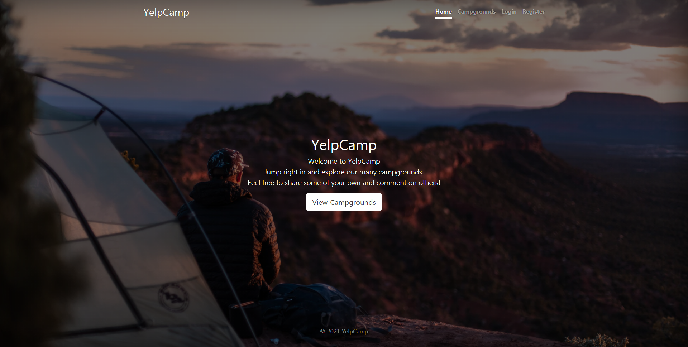

# YelpCamp
Javascript Project - UDemy WDB

## 프로젝트 개요
Udemy 내 Web Developer BootCamp 2021를 통해 배운 HTML, CSS, BootStrap, JavaScript, Node.js , MongoDB 등을 활용하여 CRUD가 가능한 사이트 구현

## 개발 기간
2021.03.28 ~ 2021.05.17

## 개발 환경
### 개발 언어
HTML, CSS, JavaScript, Mongo DB, Mongoose, Express, Node.js, Bootstrap

### 개발툴
VS Code, Bash

## 주요 기능
- 등록된 캠프 목록 조회
- 등록된 하나의 캠프 정보 조회
- 로그인
- 회원가입
- 캠프 정보 등록, 수정, 삭제
- 리뷰 등록, 수정

## 사이트 이미지
메인
